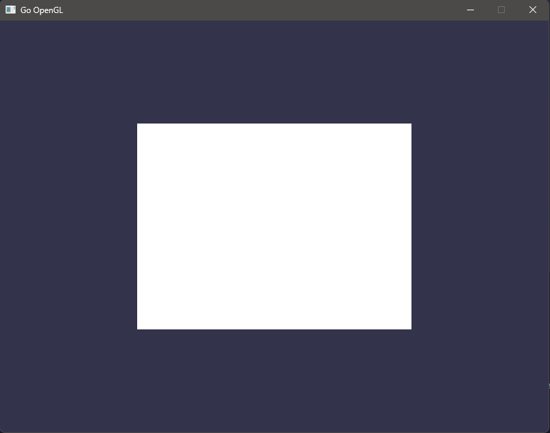

## Simple template for 2D/3D with OpenGL + GLFW

### Prerequisite
You will need something like MinGW (https://www.mingw-w64.org/)  
Add mingw to `%PATH`!

### Installation
Install: `go get .`  
Build: `make build`  
Run: `make run`  

